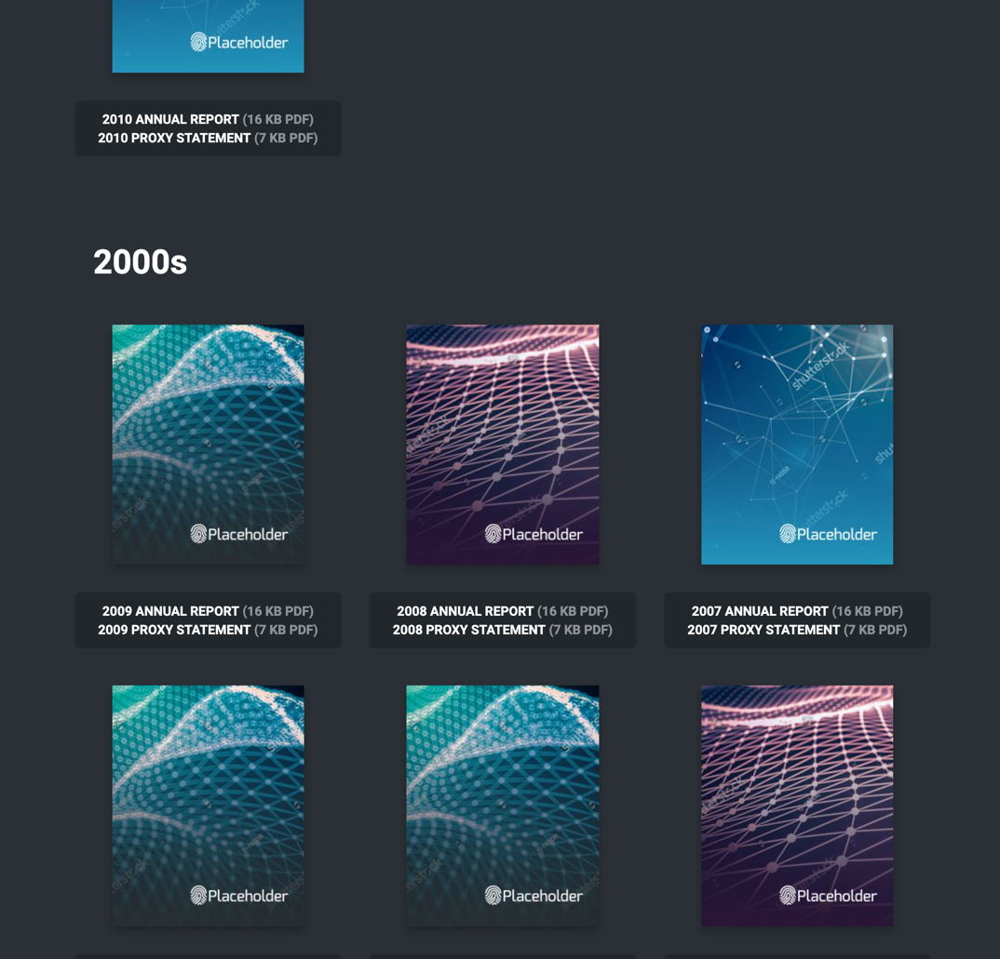
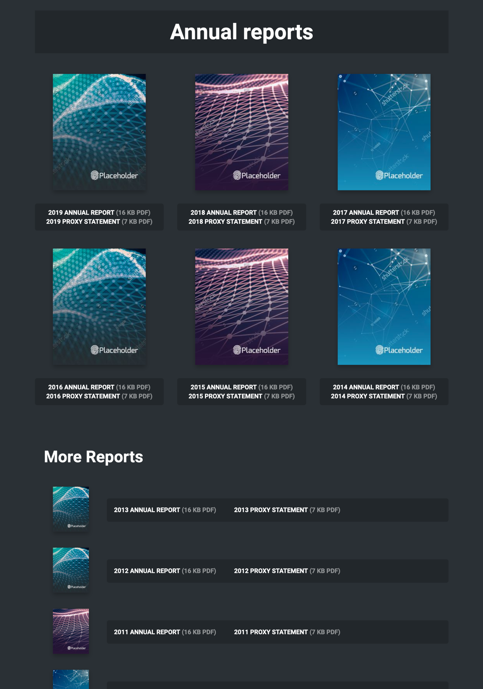
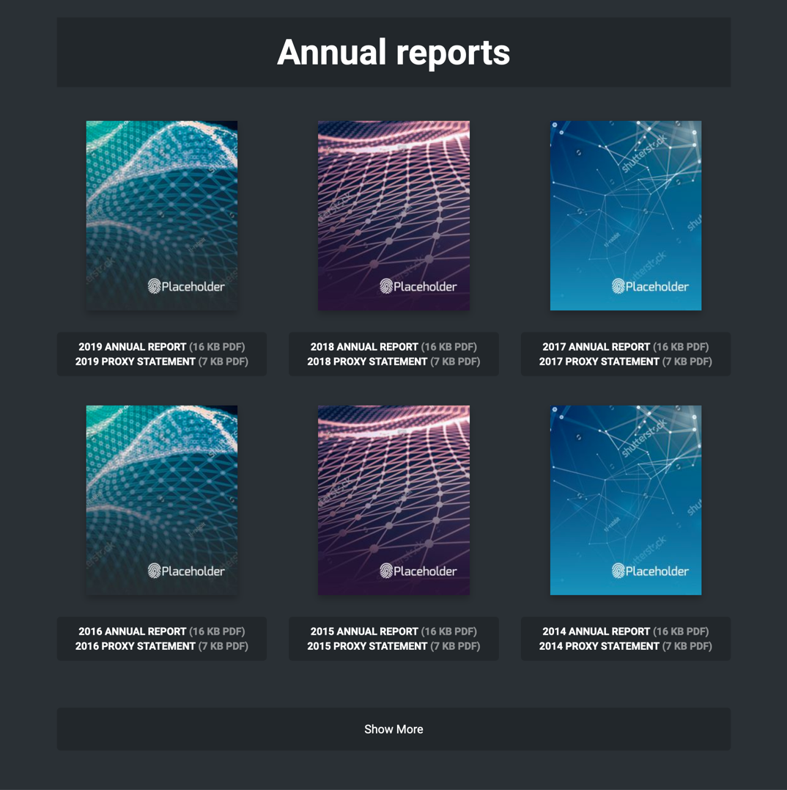

# Q4 Inc. Front End Developer Test

By default the implementation uses the layout shown in the demo screenshot and the original dataset file.

One of the criterias for evaluation is how the implementation will 'scale as more reports are added over time.' I created three other versions of the page which can be seen by editing the call to `reportsWidget.init()` in `main.js`. The goal was to provide alternatives derived from the original requirement.

Import `datasetLarge.js` instead of `dataset.js` in `index.html` to see how the view looks with a larger number of reports.

And modify `mode` in `reportsWidget.init(data: Object, mode: String)` to see the different variations. 

### `mode` can be:

`null`: Uses the standard layout shown in the test screenshot provided by Q4.

`'byDecade'`: Provides headers seperating previous decades from the current decade. This doesn't make the page shorter or reduce load time, but it does allow for better scannability.

`'byRecency'`: Shows the first six annual reports in a grid, and then groups the remaining reports in a list format to save screen real estate.

`'byShowMore'`: Shows the first six annual reports, and hides others behind a button. Pressing the button will reveal another six annual reports. The real implementation would avoid additional reports from being loaded until the user requests to do so.

